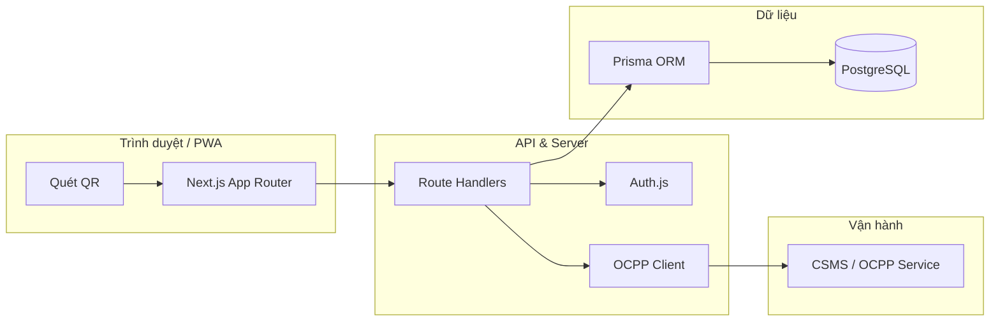

<div align="center">


<br/>

[](https://nextjs.org/)
[](https://react.dev/)
[](https://www.typescriptlang.org/)
[](https://www.prisma.io/)
[](https://www.postgresql.org/)
[](https://pnpm.io/)

**EV Green Station** — hệ thống web quản lý trạm sạc xe điện: quét **QR**, phiên sạc theo thời gian thực, tích hợp **OCPP**, phân quyền **Admin / Chủ trạm / Người dùng**.

[Kiến trúc](#-kiến-trúc-hệ-thống) · [Tính năng](#-tính-năng-chính) · [Cài đặt nhanh](#-cài-đặt-nhanh)

</div>

---

## Giới thiệu

EV Green Station là **monorepo** (`pnpm`) gồm ứng dụng **Next.js** và gói **`@ev/db`** (Prisma + PostgreSQL). Luồng người dùng được tối ưu cho trạm thực tế: **Quét QR → vào trạm → bắt đầu sạc → theo dõi kWh & tiền → dừng sạc → thanh toán (QR chuyển khoản, xác nhận)**. Hệ thống hỗ trợ **khách không đăng nhập** (thiết bị / QR) và tài khoản có **vai trò** rõ ràng cho vận hành và đối soát.

---

## Tính năng chính

| | Mô tả |
|---|--------|
| **Quét QR & vào trạm** | Điều hướng từ mã QR tại trụ; URL có thể kèm token ký (`?t=`) để tăng độ an toàn. |
| **Phiên sạc (session)** | Theo dõi trạng thái active / completed / cancelled; lưu **kWh**, **số tiền VNĐ**, mốc thời gian. |
| **OCPP & CSMS** | Trạm gắn **Charge Point ID**; tích hợp dịch vụ OCPP (có chế độ bỏ qua khi dev/demo). Ghi nhận **OcppEvent** (payload JSON). |
| **Giá & chính sách** | Giá theo trạm và **chính sách giá toàn cục** (`GlobalPricePolicy`) cho admin. |
| **Thanh toán** | Luồng thanh toán với trạng thái pending / confirmed; admin / chủ trạm xử lý **đối soát**. |
| **Poster QR in trạm** | Tiện ích tạo **poster QR** (branding, slug trạm) cho vận hành thực địa. |
| **Auth.js (NextAuth)** | Đăng nhập với adapter Prisma; phân quyền **user · station_owner · admin**. |
| **Demo / Dev** | Biến môi trường hỗ trợ demo QR, guest charging, bỏ OCPP khi chưa có CSMS. |

### Vai trò người dùng

- **Người dùng / khách** — Quét QR, sạc, xem phiên và thanh toán (kể cả không đăng nhập qua thiết bị khách).
- **Chủ trạm (`station_owner`)** — Quản lý trạm được gán, xem thanh toán liên quan.
- **Admin** — Người dùng, trạm, giá, thanh toán và vận hành tổng thể.

---

## Kiến trúc hệ thống



---

## Cấu trúc thư mục

```
ev-station/
├── apps/web/          # Ứng dụng Next.js (UI, API, Auth)
├── packages/db/       # Prisma schema & client (@ev/db)
├── packages/types/    # Kiểu dùng chung
├── scripts/           # Tiện ích Prisma + env
├── docs/              # Tài liệu & hình minh họa (banner README)
└── .env.example       # Mẫu biến môi trường
```

---

## Cài đặt nhanh

**Yêu cầu:** Node.js tương thích, **pnpm** (`packageManager` trong `package.json`), **PostgreSQL**.

1. **Clone & cài dependency**

   ```bash
   pnpm install
   ```

2. **Cấu hình môi trường**

   Sao chép `.env.example` thành `.env` ở thư mục gốc và điền `DATABASE_URL`, `AUTH_SECRET`, `QR_SECRET`, v.v. Chi tiết từng biến xem trong file mẫu.

3. **Database**

   ```bash
   pnpm db:generate
   pnpm db:migrate
   pnpm db:seed
   ```

4. **Chạy dev**

   ```bash
   pnpm dev
   ```

   Hoặc chỉ app web:

   ```bash
   pnpm -C apps/web dev
   ```

---

## Lệnh hữu ích (root)

| Lệnh | Mô tả |
|------|--------|
| `pnpm dev` | Chạy dev toàn workspace |
| `pnpm build` | Build tất cả package |
| `pnpm lint` / `pnpm typecheck` | Kiểm tra code |
| `pnpm db:generate` | Sinh Prisma Client |
| `pnpm db:migrate` | Deploy migration |
| `pnpm db:seed` | Seed dữ liệu |
| `pnpm vercel-build` | Pipeline build gần giống Vercel |

---

## Hình ảnh minh họa giao diện

> **Gợi ý:** Thêm ảnh chụp màn hình thật vào `docs/screenshots/` (ví dụ `home.png`, `scan.png`, `session.png`) và chèn vào đây:

```markdown


```

Banner phía trên (`docs/readme-banner.svg`) có thể chỉnh màu / chữ trực tiếp trong file SVG cho đồng bộ thương hiệu.

---

## Triển khai

- **Vercel:** script `vercel-build` đã gồm `prisma generate`, build `packages/types`, `packages/db`, `apps/web`.
- **HTTPS:** Khuyến nghị cho camera quét QR trên thiết bị di động (xem gợi ý trong `.env.example`).

---

## Giấy phép & liên hệ

Dự án **private** (`package.json`). Điều chỉnh phần license / team nội bộ theo quy trình công ty bạn.

---

<div align="center">

**EV Green Station** — *Quét QR → Sạc → Thanh toán.*

</div>
